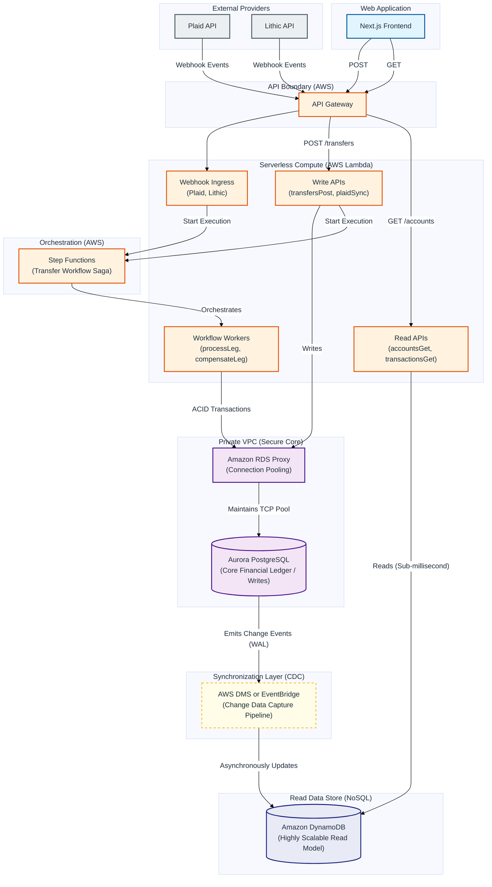

```mermaid
%%{init: { 'theme': 'base', 'themeVariables': { 'primaryTextColor': '#232f3e', 'edgeLabelBackground':'#ffffff', 'tertiaryTextColor': '#232f3e' } } }%%
graph TD
    subgraph "Web Application"
        UI["Next.js Frontend"]
    end

    subgraph "API Boundary (AWS)"
        APIGW["API Gateway"]
    end

    subgraph "Serverless Compute (AWS Lambda)"
        L_Read["Read APIs<br/>(accountsGet, transactionsGet)"]
        L_Write["Write APIs<br/>(transfersPost, plaidSync)"]
        L_Webhooks["Webhook Ingress<br/>(Plaid, Lithic)"]
        L_Workers["Workflow Workers<br/>(processLeg, compensateLeg)"]
    end

    subgraph "Orchestration (AWS)"
        SFN["Step Functions<br/>(Transfer Workflow Saga)"]
    end

    subgraph "Read Data Store (NoSQL)"
        DDB[("Amazon DynamoDB<br/>(Highly Scalable Read Model)")]
    end

    subgraph "Private VPC (Secure Core)"
        Proxy["Amazon RDS Proxy<br/>(Connection Pooling)"]
        RDS[("Aurora PostgreSQL<br/>(Core Financial Ledger / Writes)")]
    end

    subgraph "Synchronization Layer (CDC)"
        DMS["AWS DMS or EventBridge<br/>(Change Data Capture Pipeline)"]
    end

    subgraph "External Providers"
        Plaid["Plaid API"]
        Lithic["Lithic API"]
    end

    %% User Interaction
    UI -- "GET" --> APIGW
    UI -- "POST" --> APIGW

    %% API Routing
    APIGW -- "GET /accounts" --> L_Read
    APIGW -- "POST /transfers" --> L_Write

    %% Webhook Ingress
    Plaid -- "Webhook Events" --> APIGW
    Lithic -- "Webhook Events" --> APIGW
    APIGW --> L_Webhooks

    %% Orchestration Flows
    L_Write -- "Start Execution" --> SFN
    L_Webhooks -- "Start Execution" --> SFN
    SFN -- "Orchestrates" --> L_Workers

    %% Write Operations (Routed through Proxy to RDS)
    L_Write -- "Writes" ---> Proxy
    L_Workers -- "ACID Transactions" ---> Proxy
    Proxy -- "Maintains TCP Pool" ---> RDS

    %% CDC Sync Process
    RDS -- "Emits Change Events (WAL)" ---> DMS
    DMS -- "Asynchronously Updates" ---> DDB

    %% Read Operations
    L_Read -- "Reads (Sub-millisecond)" ---> DDB

    classDef web fill:#e1f5fe,stroke:#01579b,stroke-width:2px
    classDef aws fill:#fff3e0,stroke:#e65100,stroke-width:2px
    classDef secure fill:#f1f8e9,stroke:#33691e,stroke-width:2px,stroke-dasharray: 5 5
    classDef db_rel fill:#f3e5f5,stroke:#4a148c,stroke-width:2px
    classDef db_nosql fill:#e8eaf6,stroke:#1a237e,stroke-width:2px
    classDef sync fill:#fffde7,stroke:#fbc02d,stroke-width:2px,stroke-dasharray: 5 5
    classDef ext fill:#eceff1,stroke:#455a64,stroke-width:2px

    class UI web
    class APIGW,L_Read,L_Write,L_Webhooks,L_Workers,SFN aws
    class Proxy,RDS db_rel
    class DDB db_nosql
    class DMS sync
    class Plaid,Lithic ext
```